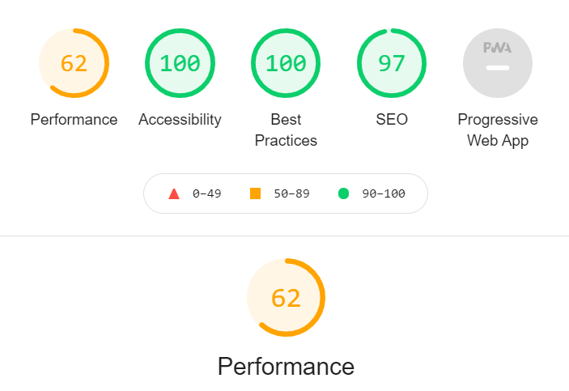

Drone Studio

A photography and video website with drones to take pictures. 

Image

Features
    Navigation
        At top left of the page is the name of the website: Drone Studio that links to the website.

        The other navigation links are to the right: Home, Motion, Graphic and Contact which link to different web pages. 

        Navigation is in a font that contrast with the background.

        Navigation is easy to understand. 

Drone Studio
    Drone Studio text tell that they want to bring you pictures by the help of drones. 

Motion
    Video with play/pause, mute button. 

Graphic
    Pictures in a brick layout. 

Contact
    Contact form with firstname, lastname, and email

Testing
    I confirm that the navigation, header, and buttons all are readable and easy to understand. 

    I confirm that the website is somewhat responsive but could use more work. 

   I have confirmed that the form works, requires entries in last name and email, will only accept email in email field and submit button works. 

 Bugs
 index.html: Section lacks heading. May be fixed by using alternative ways to make a button of the header. 

Validator Testing
    HTML:
        index.html 
        Testet with result that the sections lacks heading. This is a result from making the headings in section above so it can function as a button at the same time. 

        motion.html
        Document checking completed. No errors or warnings to show.

        graphic.html
        Document checking completed. No errors or warnings to show.

        contact.html
        Document checking completed. No errors or warnings to show.

    CSS: No errors were found when passing through the official(Jigsaw) validator. 

    Accessibility:
    I confirmed that the colors and fonts chosen are easy to read and accessible by running it through lighthouse in devtools

 

Unfixed Bugs
 index.html: Section lacks heading. 

Deployment

Credits
    Content
    Most of this work is thanks to the Running Wild project from Code Institute. 

    How to Embed Video to HTML Document- https://www.youtube.com/watch?v=HFTvaOjWk2c&ab_channel=genARate

    Center align video- https://stackoverflow.com/questions/17508729/how-do-you-center-a-video-using-css/31880583

    Autoplay- 	
    https://www.w3schools.com/tags/att_video_autoplay.asp
	https://discuss.codecademy.com/t/autoplay-video-attribute-not-working/442167
	https://www.w3schools.com/tags/att_video_muted.asp

    resize image- https://www.geeksforgeeks.org/resize-image-proportionally-with-css/

    fonts- https://fontawesome.com/
    
    Media: All images and videos are from Pexels. 